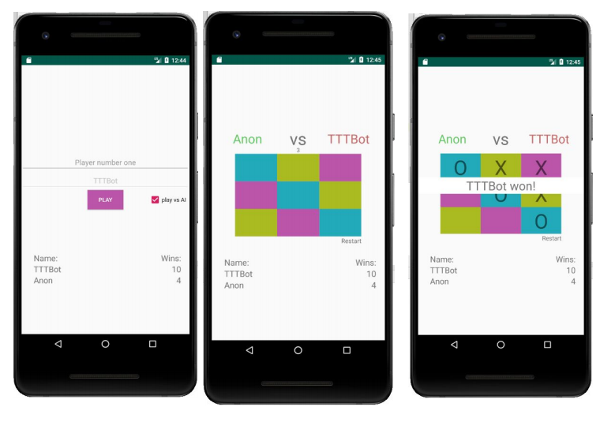

# Tic Tac Toe Android

## Forklaring

Når app-en starter laster MainActivity ResultFragment som blir værende. Den laster også inn
LoginFragment som tar inn to navn, hvis man trykker på spill mot AI her låses den ene og
navnet settes som TTTBot. Når man da trykker play byttes fragment over til GameFragment
igjennom Mainactivity.

Jeg har prøvd å gjøre det så enkelt som mulig, derfor bruker spillernavn som indikasjon på
hvorvidt man spiller mot AI eller ikke.
GameFragment inneholder all logikk rundt spill og AI. Når spillet er over oppdaterer
GameFragment databasen med antall seire for spilleren som vant. ResultFragment oppdateres
ikke automatisk når gamefragment oppdaterer databasen. Dette kunne vært løst med LiveData
istedenfor.

Logikken rundt spillet er at den etter hvert trekk leser brettet og leser over en array av “winning
conditions” som inneholder tall som reflekterer posisjoner på brettet, hvis alle tallene i en
condition er møtt så har spilleren vunnet. Hvis brettetet er fullt, er det uavgjort.
Logikken rundt AI er bygd opp rundt “Hvordan unngå at motstanderen vinner”-prinsippet. AI
prøver å aldri å vinne med mindre den ser muligheten umiddelbart. Hvis ikke så ser den om
spilleren er i nærheten av en “winning condition”, altså 3 av kravene møtt. Så er det noen edge
cases; hvis spiller starter med en x ihvert hjørne så må computeren ikke følge reglene men sette
langs siden istedenfor.

Jeg har brukt en standard generisk implementasjon av Database, Room og Adapter og føler
ikke at disse gir grunnlag for refleksjon.

### Styrker og svakheter

## Svakheter
● App-en har svakheter i fragment-arkitekturen. Det burde ha vært bedre forhold imellom
fragments og istedenfor at LoginFragment kaller gamefragment igjennom mainactivity
kunne dette for eksempel gått direkte.
● App-en har også svakheter i minne, noen ganger vil den ikke starte og jeg vet ikke
hvorfor. Det kunne kanskje løst opp litt minne ved å bygge opp utseende med
relativeLayout istedenfor constraintLayout. Vet ikke om dette gjelder men har plukket det
opp på nett.
● Største synlig svakhet er at bruker må lukke og åpne app-en for å se oppdatering i
resultFragment

## Styrker
● Appen sin styrke er spill-logikken og logikken bak AI-en, den er uslåelig.
